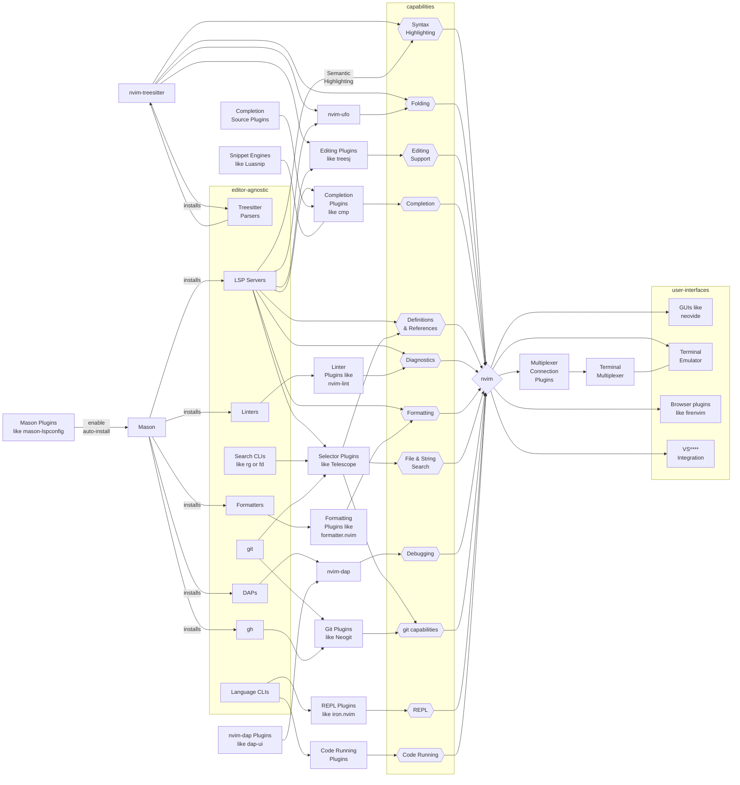

The nvim ecosystem is quite large with many moving parts, so I tried to chart out "state-of-the-art" components that make up the ecosystem.

And here is the mermaid source:

```mermaid
flowchart LR

nvim-treesitter --"installs"--> Parsers
Parsers --> nvim-treesitter --> Syntax --> nvim
nvim-treesitter --> Folding
nvim-treesitter --> FoldingPlugins --> Folding --> nvim
nvim-treesitter --> EditingPlugins[Editing Plugins\nlike treesj] --> Editing --> nvim

LSP --> ComplPlugins[Completion \nPlugins \nlike cmp] --> Completion --> nvim
ComplSources[Completion\nSource Plugins] --> ComplPlugins
Snippet[Snippet Engines\n like Luasnip] --- ComplPlugins

LSP --> FoldingPlugins[nvim-ufo]
LSP --> DefRef --> nvim
LSP --> SelectorPlugins --> DefRef
LSP --> EditingPlugins
LSP --"Semantic\n Highlighting"--> Syntax
LSP --> Diagnostics --> nvim
LSP --> Formatting --> nvim
Formatters --> FormatPlugins[Formatting \nPlugins like \nformatter.nvim] --> Formatting
Linters --> LinterPlugins[Linter \nPlugins like \nnvim-lint] --> Diagnostics

CLI --> SelectorPlugins[Selector Plugins \nlike Telescope] --> Search --> nvim

DAPs --> nvim-dap --> Debugging --> nvim
DapPlugins[nvim-dap Plugins \nlike dap-ui] --> nvim-dap


MP[Mason Plugins\n like mason-lspconfig] --"enable\nauto-install"--> Mason
Mason --installs--> LSP
Mason --installs--> Formatters
Mason --installs--> Linters
Mason --installs--> DAPs
Mason --installs--> gh

git --> SelectorPlugins --> gitCapabilities --> nvim
git --> GitPlugins[Git Plugins\n like Neogit] --> gitCapabilities
gh --> GitPlugins

languageCLIs  --> replPlugins[REPL Plugins \nlike iron.nvim] --> REPL --> nvim
languageCLIs  --> runPlugins[Code Running \nPlugins] --> CodeRunning --> nvim

subgraph editor-agnostic
	languageCLIs[Language CLIs]
	gh
	git
	LSP[LSP Servers]
	Formatters
	Linters
	DAPs
	CLI[Search CLIs \nlike rg or fd]
	Parsers[Treesitter\n Parsers]
end

subgraph capabilities
	REPL{{REPL}} 
	CodeRunning{{Code Running}} 
	gitCapabilities{{git capabilities}}
	Diagnostics{{Diagnostics}}
	Formatting{{Formatting}}
	Folding{{Folding}}
	Completion{{Completion}}
	DefRef{{Definitions\n & References}}
	Search{{File & String \nSearch}}
	Debugging{{Debugging}}
	Syntax{{Syntax\n Highlighting}}
	Editing{{Editing\n Support}}
end

nvim{nvim}
nvim --> GUI
nvim --> Terminal
Multiplexer[Terminal\nMultiplexer] --- Terminal
nvim --> MultiplexPlugins[Multiplexer\n Connection\n Plugins] --> Multiplexer
nvim --> Browser
nvim --> VSCode

subgraph user-interfaces
	GUI[GUIs like\nneovide]
	Terminal[Terminal\nEmulator]
	Browser[Browser plugins \nlike firenvim]
	VSCode[VS**** \nIntegration]
end
```
